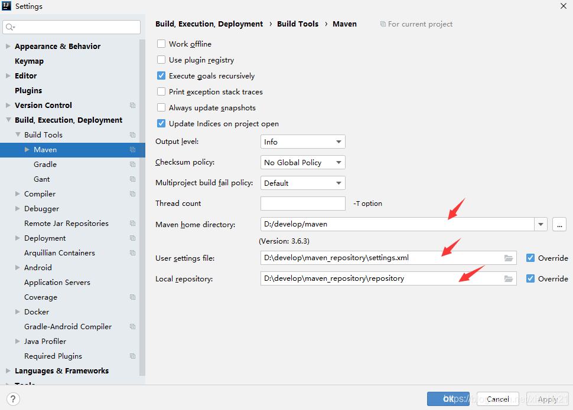

# HBase Java api入门代码案例

## 1.背景

1. 在HBase的访问方式中，主要划分2种方式，一种是shell命令行，一种就是java api方式。这一点跟很多服务器端框架一样，都是会提供一个命令行客户端和api接口操作
2. shell命令行指令，可以看我的另一篇博文[HBase shell](https://blog.csdn.net/xiaohu21/article/details/108288187)

## 2.环境准备

1. Idea2020版本
2. Maven环境3.6.3 [Maven安装](https://blog.csdn.net/xiaohu21/article/details/108137771)
3. JDK1.8 [JDK安装](https://blog.csdn.net/xiaohu21/article/details/108248307)
4. HBase 2.2.5
   
5. maven项目的pom文件

```xml
<properties>
        <project.build.sourceEncoding>UTF-8</project.build.sourceEncoding>
        <maven.compiler.source>1.8</maven.compiler.source>
        <maven.compiler.target>1.8</maven.compiler.target>
    </properties>
<dependencies>
<dependency>
    <groupId>org.apache.zookeeper</groupId>
    <artifactId>zookeeper</artifactId>
    <version>3.4.6</version>
</dependency>

<dependency>
    <groupId>org.apache.hadoop</groupId>
    <artifactId>hadoop-auth</artifactId>
    <version>3.2.1</version>
</dependency>

<dependency>
    <groupId>junit</groupId>
    <artifactId>junit</artifactId>
    <version>4.12</version>
    <scope>compile</scope>
</dependency>

<dependency>
    <groupId>org.apache.hbase</groupId>
    <artifactId>hbase-client</artifactId>
    <version>2.2.5</version>
</dependency>

<dependency>
    <groupId>org.apache.hadoop</groupId>
    <artifactId>hadoop-client</artifactId>
    <version>3.2.1</version>
</dependency>

<dependency>
    <groupId>org.apache.hadoop</groupId>
    <artifactId>hadoop-common</artifactId>
    <version>3.2.1</version>
</dependency>

<dependency>
    <groupId>org.apache.hbase</groupId>
    <artifactId>hbase-server</artifactId>
    <version>2.2.5</version>
</dependency>

<!-- 使用mr程序操作hbase 数据的导入 -->
<dependency>
    <groupId>org.apache.hbase</groupId>
    <artifactId>hbase-mapreduce</artifactId>
    <version>2.2.5</version>
</dependency>

<dependency>
    <groupId>com.google.code.gson</groupId>
    <artifactId>gson</artifactId>
    <version>2.8.5</version>
</dependency>

<!-- phoenix 凤凰 用来整合Hbase的工具 -->
<dependency>
    <groupId>org.apache.phoenix</groupId>
    <artifactId>phoenix-core</artifactId>
    <version>5.0.0-HBase-2.0</version>
</dependency>

</dependencies>

<build>
<plugins>
    <plugin>
        <groupId>org.apache.maven.plugins</groupId>
        <artifactId>maven-compiler-plugin</artifactId>
        <version>3.5.1</version>
        <configuration>
            <source>1.8</source>
            <target>1.8</target>
        </configuration>
    </plugin>

    <plugin>
        <groupId>org.apache.maven.plugins</groupId>
        <artifactId>maven-assembly-plugin</artifactId>
        <version>2.6</version>
        <configuration>
            <descriptorRefs>
                <descriptorRef>jar-with-dependencies</descriptorRef>
            </descriptorRefs>
        </configuration>
        <executions>
            <execution>
                <id>make-assembly</id>
                <!-- bind to the packaging phase -->
                <phase>package</phase>
                <goals>
                    <goal>single</goal>
                </goals>
            </execution>
        </executions>
    </plugin>

</plugins>
</build>
```

1. 设置Idea的maven配置（Idea的File-》Settings）
   
2. Hadoop集群（Hadoop 3.2.1集群），需要启动hdfs集群功能
3. zookeeper（3.4.6集群），需要启动集群功能，并且设置
   注意，这里的环境要求和shell命令行客户端使用要求一样，不清楚如何搭建HBase环境，可以看我另一篇博文 [HBase搭建](https://blog.csdn.net/xiaohu21/article/details/108269327)

## 3.案例代码

1. 注意，本文所有代码没有做太多封装和复用，好处是，代码直接拷贝，修改一下参数就可以方法这个粒度运行，坏处是代码不够优雅。
2. 需要优化的话，可以从Connection获取，以及其他一些代码复用方面考虑。本文只做最基本的代码演示。

### 3.1 namespace代码

```java
static private void namespace() {
        // 创建配置对象
        Configuration conf = HBaseConfiguration.create();
        // 设置zookeeper的集群地址
        conf.set("hbase.zookeeper.quorum", "linux-100:2181,linux-101:2181,linux-102:2181");

        Connection connection = null;
        Admin admin = null;
        try {
            // 创建连接对象
            connection = ConnectionFactory.createConnection(conf);

            // 创建管理者对象
            admin = connection.getAdmin();

            // 创建namespace之前，先判断是否存在，存在就删除
            NamespaceDescriptor doit = admin.getNamespaceDescriptor("doit");
            if(doit != null) {
                // 删除namespace先删除表
                TableName[] doits = admin.listTableNamesByNamespace("doit");
                for (TableName tableName : doits) {
                    admin.disableTable(tableName);

                    admin.deleteTable(tableName);
                }

                // 删除namespace
                admin.deleteNamespace("doit");
            }

            // 获取namespace的构建器，通过构建器可以对构造对象设置更多属性
            NamespaceDescriptor.Builder builder = NamespaceDescriptor.create("doit");
            // 参数map
            Map<String, String> map = new HashMap<String, String>();
            map.put("author", "hudashuai");
            map.put("ctime", System.currentTimeMillis()+"");
            // 将参数map传给构建器
            builder.addConfiguration(map);

            // 获取构建出来的对象
            NamespaceDescriptor namespaceDescriptor = builder.build();

            // admin创建namespace的方法
            admin.createNamespace(namespaceDescriptor);
            
        } catch (Exception e) {
            e.printStackTrace();
        }finally {
            // 关流
            try {
                if(admin != null) {
                    admin.close();
                }
                if(connection != null) {
                    connection.close();
                }
            } catch (IOException e) {
                e.printStackTrace();
            }
        }
    }
```

### 3.2 table

```java
private static void table() {
        // 创建配置对象
        Configuration conf = HBaseConfiguration.create();
        // 设置zookeeper的集群地址
        conf.set("hbase.zookeeper.quorum", "linux-100:2181,linux-101:2181,linux-102:2181");

        Connection connection = null;
        Admin admin = null;

        try {
            // 创建连接
            connection = ConnectionFactory.createConnection(conf);

            // 创建一个构建器
            TableDescriptorBuilder tableDescriptorBuilder = TableDescriptorBuilder.newBuilder(TableName.valueOf("doit:tb_shoes"));

            // 创建列族的list
            List<ColumnFamilyDescriptor> columnList = new ArrayList<ColumnFamilyDescriptor>();

            ColumnFamilyDescriptorBuilder columnFamilyDescriptorBuilder = ColumnFamilyDescriptorBuilder.newBuilder("cf1".getBytes());
            columnFamilyDescriptorBuilder.setMaxVersions(4);// 数据存储版本数
            columnFamilyDescriptorBuilder.setTimeToLive(60*4);// TTL 单位是秒
            ColumnFamilyDescriptor cf1 = columnFamilyDescriptorBuilder.build();
            columnList.add(cf1);

            ColumnFamilyDescriptorBuilder columnFamilyDescriptorBuilder2 = ColumnFamilyDescriptorBuilder.newBuilder("cf2".getBytes());
            ColumnFamilyDescriptor cf2 = columnFamilyDescriptorBuilder2.build();
            columnList.add(cf2);

            // 设置列族
            tableDescriptorBuilder.setColumnFamilies(columnList);

            // 构建出对象
            TableDescriptor build = tableDescriptorBuilder.build();

            // 创建出admin对象
            admin = connection.getAdmin();

            admin.createTable(build);

        } catch (Exception e) {
            e.printStackTrace();
        } finally {
            try {
                // 关流
                if(admin != null) {
                    admin.close();
                }

                if(connection != null) {
                    connection.close();
                }
            } catch (IOException e) {
                e.printStackTrace();
            }
        }
    }
```

### 3.3table中数据的增删改查

注意，由于hbase基于hdfs设计，所以数据的增删改本身都是新增一条数据，之后根据触发策略对这些数据做合并。

#### 3.3.1 get方式获取数据

1. 获取单个Get对象对应数据

```java
 private static void get1() {
        // 创建配置对象
        Configuration conf = HBaseConfiguration.create();
        // 设置zookeeper的集群地址
        conf.set("hbase.zookeeper.quorum", "linux-100:2181,linux-101:2181,linux-102:2181");

        Connection connection = null;
        Table tb_haha = null;
        try {
            // 创建连接
            connection = ConnectionFactory.createConnection(conf);

            // 获取table对象
            tb_haha = connection.getTable(TableName.valueOf("tb_haha"));

            // 创建get对象
            Get rk1 = new Get(Bytes.toBytes("rk3"));

            // 获取查询结果集合
            Result result = tb_haha.get(rk1);

            // 遍历结果集合
            while (result.advance()){
                // 获取单元格对象
                Cell cell = result.current();

                // 分别获取row、family--列族、qualifier-列名、value-单元对应的值
                // 注意，由于hbase本身没有定义数据类型，所以数据其实是以字节数组存储，默认是字符串类型。这里使用CellUtil取出数据就隐式的帮我们处理了数据编码的问题
                byte[] row = CellUtil.cloneRow(cell);
                byte[] family = CellUtil.cloneFamily(cell);
                byte[] qualifier = CellUtil.cloneQualifier(cell);
                byte[] value = CellUtil.cloneValue(cell);

				// 这里使用hbase的工具类Bytes进行数据的转换，可以避免数据读取和展示出错的问题
				// 实际生产中，数据一般都是以字符串类型读写，这样方便处理
                System.out.println("row:" + Bytes.toString(row) +
                        "family:" + Bytes.toString(family) +
                        "qualifier:" + Bytes.toString(qualifier)+
                        "value:" + Bytes.toString(value));
            }
        } catch (Exception e) {
            e.printStackTrace();
        }finally {
            try {
                // 关流
				if(tb_haha  != null) {
					tb_haha.close();
				}

                if(connection != null) {
                    connection.close();
                }
            } catch (IOException e) {
                e.printStackTrace();
            }
        }
    }
```

1. 获取多个Get对象对应数据

```java
private static void get2() {
        // 创建配置对象
        Configuration conf = HBaseConfiguration.create();
        // 设置zookeeper的集群地址
        conf.set("hbase.zookeeper.quorum", "linux-100:2181,linux-101:2181,linux-102:2181");

        Connection connection = null;
        Table tb_haha = null;
        try {
            // 创建连接
            connection = ConnectionFactory.createConnection(conf);

            tb_haha = connection.getTable(TableName.valueOf("tb_haha"));

            // 创建多个get对象
            Get rk2 = new Get(Bytes.toBytes("rk2"));
            Get rk3 = new Get(Bytes.toBytes("rk3"));

            // 创建get列表
            List<Get> gets = new ArrayList<>();
            gets.add(rk2);
            gets.add(rk3);

            // 根据传入的get列表，进行查询
            Result[] results = tb_haha.get(gets);

            // 遍历结果集
            for (Result result : results) {

                // 迭代取出每个结果集中数据
                while (result.advance()) {
                    Cell cell = result.current();

                    // 分别获取row、family--列族、qualifier-列名、value-单元对应的值
                    byte[] row = CellUtil.cloneRow(cell);
                    byte[] family = CellUtil.cloneFamily(cell);
                    byte[] qualifier = CellUtil.cloneQualifier(cell);
                    byte[] value = CellUtil.cloneValue(cell);

                    System.out.println("row:" + Bytes.toString(row) +
                            "family:" + Bytes.toString(family) +
                            "qualifier:" + Bytes.toString(qualifier) +
                            "value:" + Bytes.toString(value));
                }
            }
        } catch (Exception e) {
            e.printStackTrace();
        }finally {
            try {
				if(tb_haha  != null ) {
					tb_haha.close(); 
				}
                if(connection != null) {
                    connection.close();
                }
            } catch (IOException e) {
                e.printStackTrace();
            }
        }

    }
```

#### 3.3.2 scan扫描数据

注意，因为hbase本身是基于key value形式进行存储。所以最好的查询和获取数据方式是直接通过get，然后key value形式取出数据，采用scan的方式会有很大的性能损耗。get结合filter可以做到scan一样的效果且性能更好、

1. 以rowkey开始和结束为区间，进行扫描

```java
private static void scan() {
        // 创建配置对象
        Configuration conf = HBaseConfiguration.create();
        // 设置zookeeper的集群地址
        conf.set("hbase.zookeeper.quorum", "linux-100:2181,linux-101:2181,linux-102:2181");

        Connection connection = null;
        Table tb_haha = null;
        try {
            // 建立连接，这里给的是zookeeper集群中每个节点地址，
            // 这样就算一个节点失败，还会尝试连接其他节点1
            connection = ConnectionFactory.createConnection(conf);

            // 获取table表对象
            tb_haha = connection.getTable(TableName.valueOf("tb_haha"));

            // 创建scan对象
            Scan scan = new Scan();
            // 从rk2开始
            scan.withStartRow(Bytes.toBytes("rk2"));
            // 到rk3结束，但是不包括rk3
            scan.withStopRow(Bytes.toBytes("rk3"));

            // 获取结果扫描器
            ResultScanner resultScanner = tb_haha.getScanner(scan);

            // 获取迭代器
            Iterator<Result> iterator = resultScanner.iterator();

            while (iterator.hasNext()) {
                Result result = iterator.next();

                // 遍历结果集合
                while (result.advance()) {
                    // 获取单元格对象
                    Cell cell = result.current();

                    // 分别获取row、family--列族、qualifier-列名、value-单元对应的值
                    byte[] row = CellUtil.cloneRow(cell);
                    byte[] family = CellUtil.cloneFamily(cell);
                    byte[] qualifier = CellUtil.cloneQualifier(cell);
                    byte[] value = CellUtil.cloneValue(cell);

                    System.out.println("row:" + Bytes.toString(row) +
                            " family:" + Bytes.toString(family) +
                            " qualifier:" + Bytes.toString(qualifier) +
                            " value:" + Bytes.toString(value));
                }
            }

        } catch (Exception e) {
            e.printStackTrace();
        } finally {
            try {
                // 关流
				if(tb_haha != null) {
					tb_haha.close();
				}
                if(connection != null) {
                    connection.close();
                }
            } catch (IOException e) {
                e.printStackTrace();
            }
        }
    }
```

1. 扫描对应rowkey以及对应列名的数据

```java
private static void scan2() {
        // 创建配置对象
        Configuration conf = HBaseConfiguration.create();
        // 设置zookeeper的集群地址
        // 建立连接，这里给的是zookeeper集群中每个节点地址，
        // 这样就算一个节点失败，还会尝试连接其他节点1
        conf.set("hbase.zookeeper.quorum", "linux-100:2181,linux-101:2181,linux-102:2181");

        Connection connection = null;
        Table tb_haha = null;
        try {
            connection = ConnectionFactory.createConnection(conf);

            // 获取table表对象
            tb_haha = connection.getTable(TableName.valueOf("tb_haha"));

            // 传入列族、字段名作为参数，获取扫描器对象
            ResultScanner scanner = tb_haha.getScanner(Bytes.toBytes("cf1"), Bytes.toBytes("age"));

            // 获取迭代器
            Iterator<Result> iterator = scanner.iterator();

            while (iterator.hasNext()) {
                Result result = iterator.next();

                // 遍历结果集合
                while (result.advance()) {
                    // 获取单元格对象
                    Cell cell = result.current();

                    // 分别获取row、family--列族、qualifier-列名、value-单元对应的值
                    byte[] row = CellUtil.cloneRow(cell);
                    byte[] family = CellUtil.cloneFamily(cell);
                    byte[] qualifier = CellUtil.cloneQualifier(cell);
                    byte[] value = CellUtil.cloneValue(cell);

                    System.out.println("row:" + Bytes.toString(row) +
                            " family:" + Bytes.toString(family) +
                            " qualifier:" + Bytes.toString(qualifier) +
                            " value:" + Bytes.toString(value));
                }
            }

        } catch (Exception e) {
            e.printStackTrace();
        } finally {
            try {
                // 关流
                if(tb_haha != null) {
                	tb_haha.close(); 
                }
                if(connection != null) {
                    connection.close();
                }
            } catch (IOException e) {
                e.printStackTrace();
            }
        }
    }
```

#### 3.3.3 delete

注意，这里和get一样，可以传入一个Delete对象列表，删除多个数据。

```java
private static void delete() {
        // 创建配置对象
        Configuration conf = HBaseConfiguration.create();
        // 设置zookeeper的集群地址
        conf.set("hbase.zookeeper.quorum", "linux-100:2181,linux-101:2181,linux-102:2181");

        Connection connection = null;
        Table tb_haha = null;
        try {
            // 创建连接
            connection = ConnectionFactory.createConnection(conf);

            // 获取table对象
            tb_haha = connection.getTable(TableName.valueOf("tb_haha"));

            // 注意，hbase本身是没有定义数据类型的，所有数据以key value形式存储在hdfs文件中
            // 数据的读写最后都是以byte[] 字节数组形式展现，所以hbase提供了一个工具类，进行数据转换Bytes
            // 注意，如果出现编码乱码问题，可以考虑是否没有把对应信息通过Bytes工具类转换
            // 创建delete删除对象。指定是哪一列
            Delete delete = new Delete(Bytes.toBytes("rk1"));
            // 删除对象添加列族、列名信息
            delete.addColumn("cf1".getBytes(), "job".getBytes());

            // 执行delete操作，
            // 注意这里有方法重载，可以纯如delete对象数组，删除多个数据
            tb_haha.delete(delete);
            
        } catch (Exception e) {
            e.printStackTrace();
        }finally {
            try {
                if(tb_haha  != null) {
					tb_haha.close(); 
				}
                if(connection != null) {
                    connection.close();
                }
            } catch (IOException e) {
                e.printStackTrace();
            }
        }
    }
```

#### 3.3.4 put添加数据

1.使用bufferedmutator缓冲流写入

```java
private static void put3() {
        // 创建配置对象
        Configuration conf = HBaseConfiguration.create();
        // 设置zookeeper的集群地址
        conf.set("hbase.zookeeper.quorum", "linux-100:2181,linux-101:2181,linux-102:2181");

        Connection connection = null;
        BufferedMutator bufferedMutator = null;
        try {
            connection = ConnectionFactory.createConnection(conf);

            bufferedMutator = connection.getBufferedMutator(TableName.valueOf("tb_haha"));

            Put put = new Put("rk1".getBytes());
            put.addColumn(Bytes.toBytes("cf1"), Bytes.toBytes("job"), Bytes.toBytes("teacher"));
            
            bufferedMutator.mutate(put);
            
            bufferedMutator.flush();
            
        } catch (Exception e) {
            e.printStackTrace();
        } finally {
            try {
                if(bufferedMutator != null) {
                    bufferedMutator.close();
                }
                
                if (connection != null) {
                    connection.close();
                }
            } catch (IOException e) {
                e.printStackTrace();
            }
        }
        
    }
```

2.使用put添加或者更新数据

```java
private static void put() {
        // 创建配置对象
        Configuration conf = HBaseConfiguration.create();
        // 设置zookeeper的集群地址
        conf.set("hbase.zookeeper.quorum", "linux-100:2181,linux-101:2181,linux-102:2181");

		Connection connection = null;
		Table tb_haha = null;
        try {
            connection = ConnectionFactory.createConnection(conf);

            tb_haha = connection.getTable(TableName.valueOf("tb_haha"));

            Put put = new Put(Bytes.toBytes("rk1"));
            put.addColumn(Bytes.toBytes("cf1"), Bytes.toBytes("job"), Bytes.toBytes("saodi"));

            Put put2 = new Put(Bytes.toBytes("rk2"));
            put2.addColumn(Bytes.toBytes("cf2"), Bytes.toBytes("sal"), Bytes.toBytes(3000.00));

            List<Put> puts = new ArrayList<>();
            puts.add(put);
            puts.add(put2);

            tb_haha.put(puts);

            connection.close();
        } catch (IOException e) {
            e.printStackTrace();
        }finally{
			try{
				if(tb_haha  != null) {
					tb_haha.close(); 
				}
				if(connection != null) {
					connection.close(); 
				}
			}catch(Exception e) {
				e.printStackTrace();
			}
		}
    }
```

