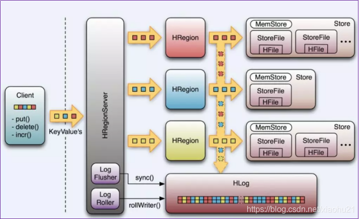
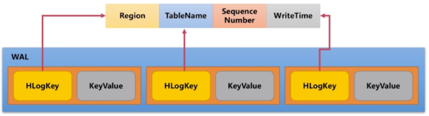
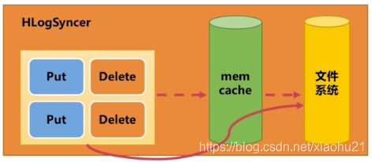
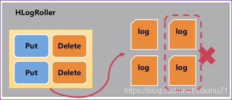

# HBase Hlog原理总结归纳

## 1. Hlog概述

1. 按照此前另外一篇博客所述，Hlog其实就是为了保存内存缓存数据现场而建立的一套机制[Hbase内部机制](https://blog.csdn.net/xiaohu21/article/details/108269299)
2. Hlog也叫做WAL文件，全名是write ahead log。
3. 故名思意，就是在数据写入到memory store之前，先把信息写入到这个wal日志文件中。

## 2. Hlog简介

1. Write Ahead Log (WAL)提供了一种高并发、持久化的日志保存与回放机制.这一点和hdfs的checkpoint机制很类似，都是通过追加形式的磁盘日志文件来还原内存数据现场，防止内存数据丢失
2. 采用磁盘文件追加可以达到很高的磁盘IO性能，具体看我另外一篇博文 [磁盘顺序读写](https://blog.csdn.net/xiaohu21/article/details/108267514)
3. 将现场以日志形式记录下来，其实有很多应用如mysql的binlog就是如此。
4. 每一个业务数据的写入操作（PUT / DELETE）执行前，都会记账在WAL中。,用来做灾难恢复只用，Hlog记录数据的所有变更,一旦数据修改，就可以从log中进行恢复
5. 每个Region Server维护一个Hlog,而不是每个Region一个

> 1. 不同region(来自不同table)的日志会混在一起，这样做的目的是不断追加单个 文件相对于同时写多个文件而言，可以减少磁盘寻址次数，因此可以提高对table的写性能。
> 2. 带来的麻烦是，如果一台region server下线，为了恢复其上的region，需要将region server上的log进行拆分，然后分发到其它region server上进行恢复。

1. HLog文件就是一个普通的Hadoop Sequence File，Sequence File 的Key是HLogKey对象，HLogKey中记录了写入数据的归属信息，除了table和region名字外，同时还包括 sequence number和timestamp，timestamp是”写入时间”，sequence number的起始值为0，或者是最近一次存入文件系统中sequence number。HLog Sequece File的Value是HBase的KeyValue对象，即对应HFile中的KeyValue.
   

## 3. Hlog组成

### 3.1 HLog对象

1. 一个HRegionServer对应一个HLog实例。当HRegion初始化时，HLog将作为一个参数传给HRegion的构造函数。
2. HLog最核心的是调用doWrite的append() 方法，前面提到的可能对数据改动的操作都就将首先调用这个方法。

> 1. 出于性能的考虑，put(), delete() 和incrementColumnValue()有一个开关函数setWriteToWAL(boolean) ， 设为false将禁用WAL。这是为什么上图中向下的箭头是虚线的原因。默认时候当然需要WAL，但是假如你运行一个数据导入的MapReduce Job，你可以通过关闭WAL获得性能上的提升。

1. HLog将通过“sequence number”追踪数据改变。它内部使用AtomicLong保证线程安全。

> sequence number的起始值为0，或者是最近一次存入文件系统中sequence number。Region打开存储文件，读取每个HFile中的最大的sequence number，如果该值大于HLog 的sequence number, 就将它作为HLog 的sequence number的值。最后，HLog将得到上次存入文件和继续记log的点
> 
> 每一个负责一段rowkey的范围。这些region将共享同一个HLog实例，我们可以看出，从不同region来的数据写入WAL的顺序是不确定的。
> 最后，Hlog利用HMaster恢复和切分一个由一个崩溃的HRegionServery遗留下来的Log。之后，重新部署regions。

### 3.2 HLogKey

1. WAL使用Hadoop的SequenceFile,它将记录存储为key/values 的数据集。
2. 对于WAL，key是一个HLogKey的实例。KeyValue不仅包括row，column family, qualifier, timestamp, value, 还包括“Key Type” ,Key Type代表一个“put”或“delete”操作。 s还记录了equence number，和“写入时间”， 是一个记录数据何时写入到log的时间戳

### 3.3 LogFilter

1. 数据以KeyValue形式到达HRegionServer，将写入WAL，之后，写入一个SequenceFile。其实存储的key/value是先存储在内存中以提高性能 ,
2. LogFlushe类它调用HLog.optionalSync(),后者根据“hbase.regionserver.optionallogflushinterval”(默认是10秒)，定期调用Hlog.sync()。
3. 另外，HLog.doWrite()也会根据“hbase.regionserver.flushlogentries”(默认100秒)定期调用Hlog.sync()。Sync() 本身调用HLog.Writer.sync()，它由SequenceFileLogWriter实现。
   

### 3.4 LogRoller

1. 定时日志的滚动和删除日志文件
2. Log的大小通过$HBASE_HOME/conf/hbase-site.xml 的“hbase.regionserver.logroll.period”限制，默认是一个小时。所以每60分钟，会打开一个新的log文件。久而久之，会有一大堆的文件需要维护。

- 首先，LogRoller调用HLog.rollWriter()，定时滚动日志，
- 之后，利用HLog.cleanOldLogs()可以清除旧的日志。
- 它首先取得存储文件中的最大的sequence number，
- 之后检查是否存在一个log所有的条目的“sequence number”均低于这个值，如果存在，将删除这个log。
  

### 3.5 Replay

1. 当HRegionServer启动，打开所管辖的region，它将检查是否存在剩余的log文件，如果存在，将调用Store.doReconstructionLog()。
2. 重放一个日志只是简单地读入一个日志，将日志中的条目加入到Memstore中。最后，flush操作将Memstore中数据flush到硬盘中。
3. 旧日志往往由region server 崩溃所产生。当HMaster启动或者检测到region server 崩溃，它将日志文件拆分为多份文件，将其存储在region所属的文件夹。之后，根据上面提到的方法，将日志重放。
4. 需要指出的是，崩溃的服务器中的region只有在日志被拆分和拷贝之后才能被重新分配。
5. 拆分日志利用HLog.splitLog()。旧日志被读入主线程内存中，之后，利用线程池将其写入所有的region文件夹中，一个线程对应于一个region。

### 3.6 WALEdit

1. 用来表示一个事务中的更新集合，在目前的版本，如果一个事务中对一行row R中三列c1，c2，c3分别做了修改，那么HLog为了行级事务原子性日志片段如下所示：
   <logseq#-for-entire-txn>:
   其中WALEdit会被序列化为格式<-1, # of edits, , , >，比如<-1, 3, , , >，其中-1作为标示符表征这种新的日志结构。

## 4. 总结

1. Hlog又称为WAL，目的就是为了防止内存数据丢失做的备份
2. 采取日志形式是有2个考虑点，第一日志存储在磁盘中，不担心丢失，第二日志采取追加形式，磁盘IO性能很高，按照kafka官方介绍，有时候磁盘顺序读写比内存随机读写还快
3. 日志最后有几个场景下使用

- 确实发生了数据丢失，这时候需要获取日志来对内存数据进行回放
- 没有发生数据丢失，这时候需要对数据进行划分，旧的无用日志就删除掉