# HBase Region原理总结

## 1. 环境准备

1. 基于Hadoop 3.2.1
2. 基于zookeeper 3.4.6
3. 基于Hbase 2.2.5

资料来源：

- 官网http://hbase.apache.org/2.2/book.html
- 网络博客、视频等资料

## 2.HBase数据存储概述

### 2.1 hbase概述

1. HBase是基于hdfs的一个数据库，也就是本身Hbase的数据存储在hdfs中。默认的，文件会分布式存储在hdfs节点中，并且按照128MB一块进行切分，并且会保存3份
2. hdfs中数据不适合存储小文件，所以后续需要定期进行文件合并和清理来保证读写效率和性能。
3. hdfs不支持随机读写，所以为了实现数据库中数据更新，hbase采取的文件追加形式来进行数据随机读写

### 2.2 rowkey概述

1. hbase本质是以key value形式进行存储，如下图所示
   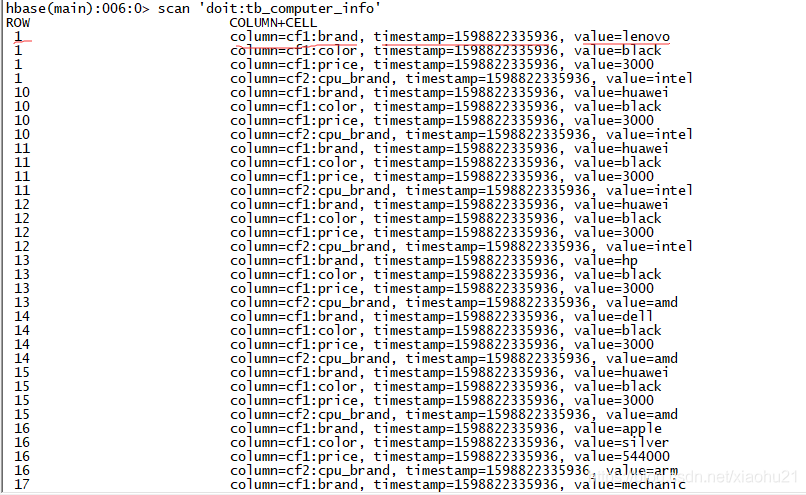
   key可以看成是row+columnfamily+qualifier+timestamp组合而成，value就是值
2. 根据此前我另外一篇博客，为了提升查询效率，在memstore、block cache、hfile中的索引都是基于rowkey建立的。
3. 这里可以看出，数据查询是基于rowkey进行的，所以rowkey的设计很重要。

- 长度一定
- 不要太长，太长会占用过多存储空间，甚至会导致key占用空间比value大不少的问题。（key后续会讲到，可以使用压缩算法进行压缩）
- 需要考虑hbase表使用场景，也就是查询维度。最好rowkey和查询维度重叠。
- 需要考虑热点问题，也就是插入热点和查询热点。

1. rowkey数据可以看出，是按照一定规则进行排序展示的，timestamp是逆序，也就是数据最新数据在最前面。这个是和Version 版本机制有关。也就是存储在hbase中数据划分版本

### 2.3 region划分概述

1. hbase的数据划分简图
   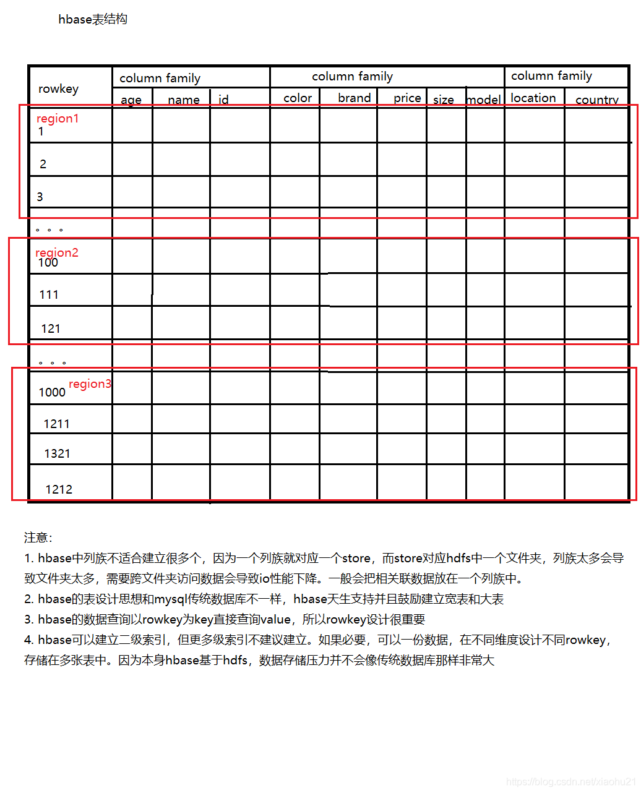

- 可以看到，region其实就是一段区间范围内rowkey对应的数据，有startkey和endkey
- 每一行rowkey对应数据，可能会有多个列族column family，一个列族中可能会有多个列名qualifier

### 2.4 hbase在[hdfs](https://so.csdn.net/so/search?q=hdfs&spm=1001.2101.3001.7020)中文件存储形式

1. 在hdfs中，hbase文件存储形式
   访问hdfs开放出来的网页端：我的地址如下，http://linux-100:9870/explorer.html#/hbase/data
2. 查看hdfs中对应hbase表的信息

- hbase目录
  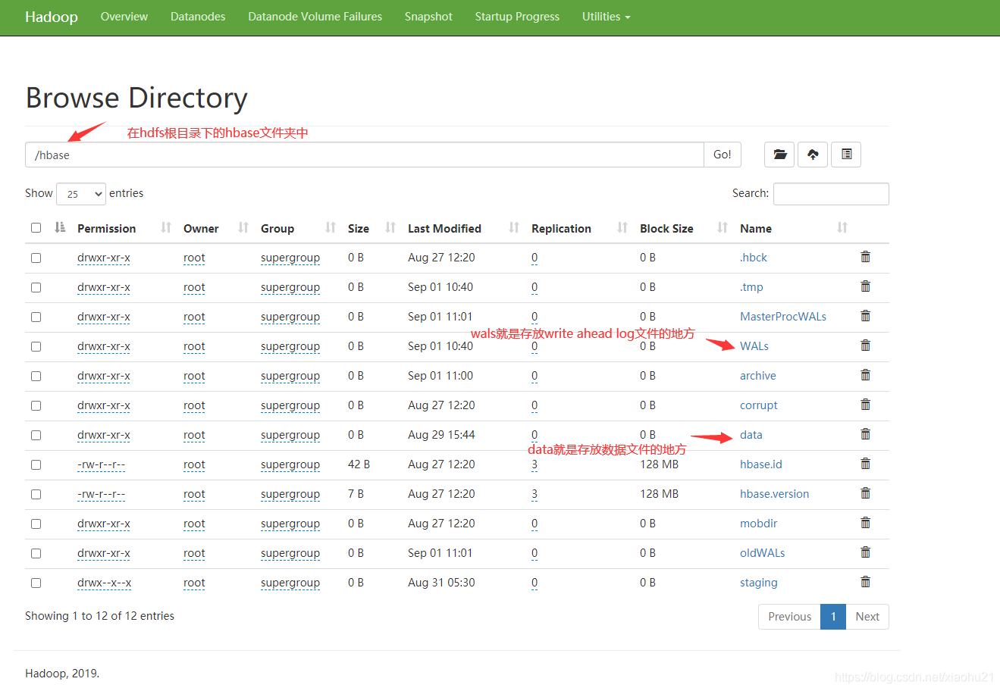
- data目录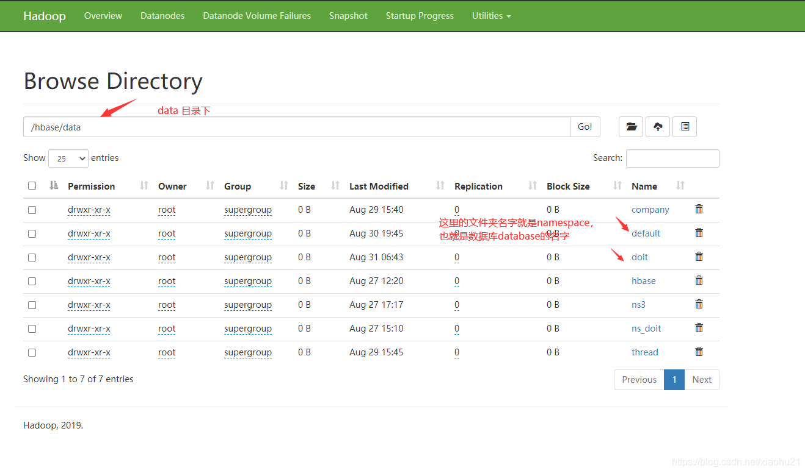
- 对应namespace目录（hbase是一个数据库，但有别于关系型数据库，所以没有沿用database的改变，而是使用了namespace的概念）
  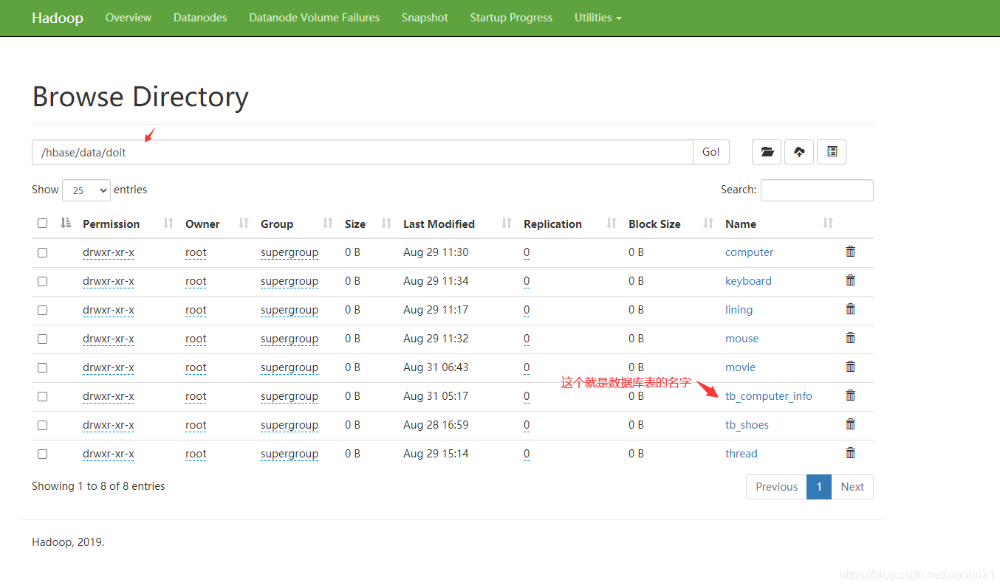
- 数据库表目录，以及内部的region目录
  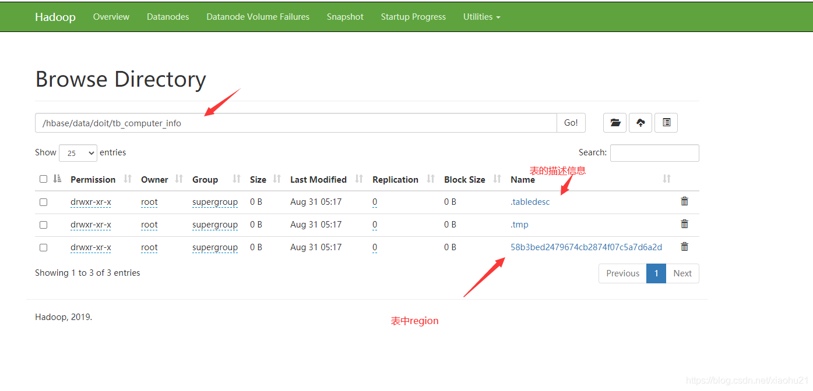
  这里直接在hbase shell客户端也可以查看到region的名字
  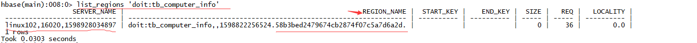
- region目录下的列族目录
  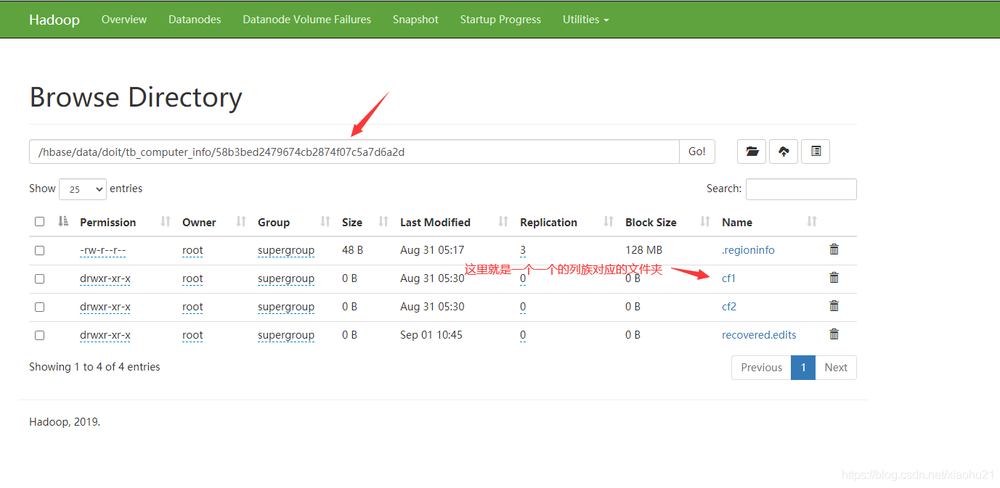
- 列族目录下的hfile文件
  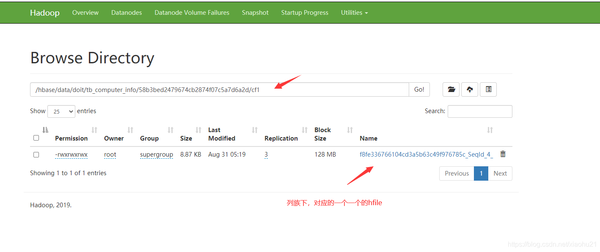

### 2.5 hfile查看

1. 直接使用hdfs dfs -cat查看，不过由于hfile有指定格式，看起来是乱码

```shell
hdfs dfs -cat /hbase/data/doit/tb_computer_info/58b3bed2479674cb2874f07c5a7d6a2d/cf1/f8fe336766104cd3a5b63c49f976785c_SeqId_4_1
```

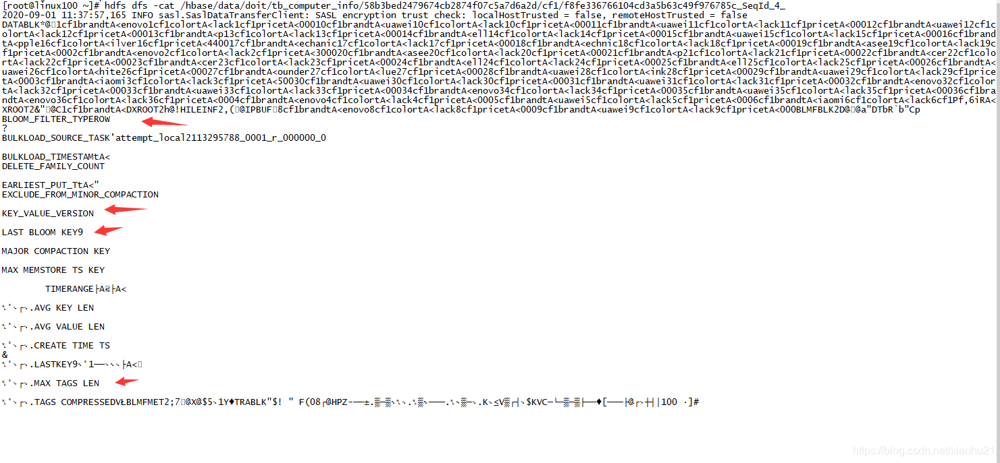
\2. 使用专门的指令查看

```shell
hbase hfile -p -f  /hbase/data/doit/tb_computer_info/58b3bed2479674cb2874f07c5a7d6a2d/cf1/f8fe336766104cd3a5b63c49f976785c_SeqId_4_1
```

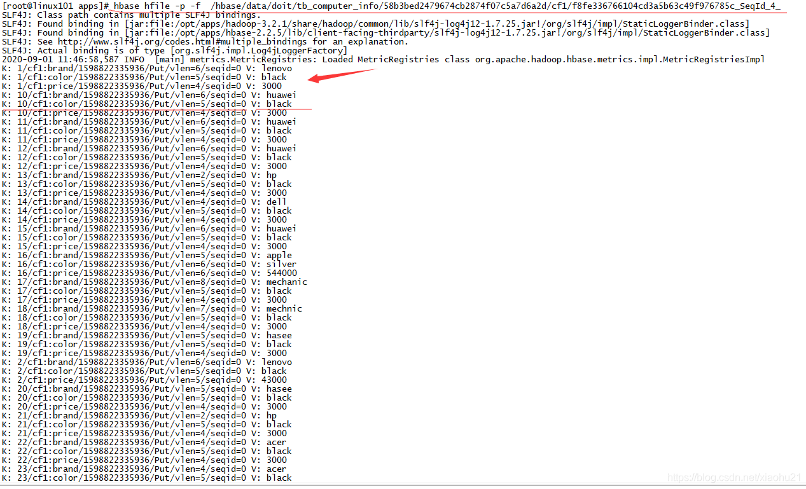

## 3. Region

1. HRegion 是hbase负载均衡的最小单位，也就是一个region只能放在一个集群节点上，不存在一个region放在多个集群节点上。
2. region可以有不同的分区策略，后面会讲到，如按照预定分区划分、大小划分等等
   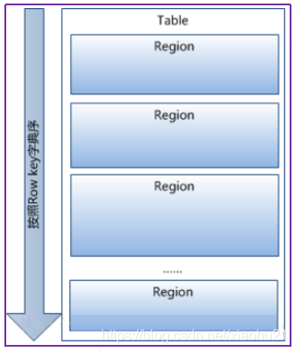
3. 默认的表只有一个region，随着数据插入越来越多，region会进行拆分。
   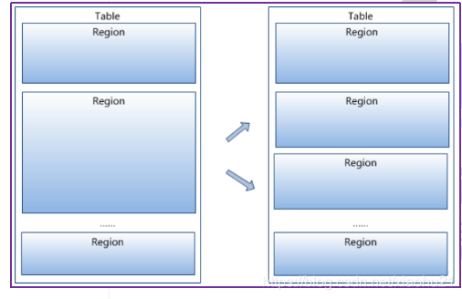
4. 一个region体现在文件实际存储时，对应一个或者多个store文件夹，一个store文件夹对应一个列族。所以列族不适合建立很多，否则文件io就需要跨文件夹，降低性能。
   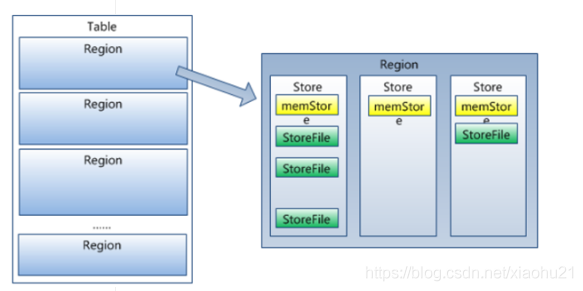
5. region server中文件组成结构
   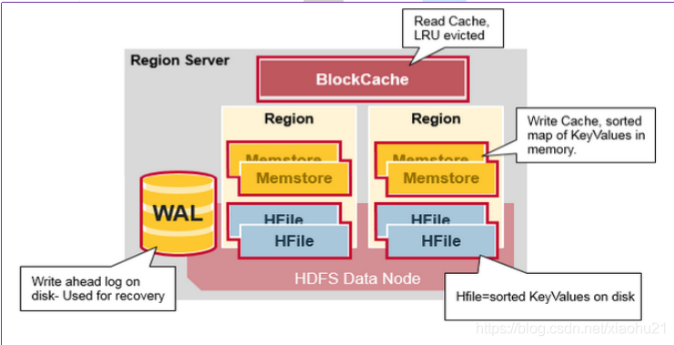
6. 之前一篇博客提到[hbase的架构](https://blog.csdn.net/xiaohu21/article/details/108269299). 其实基于hdfs的架构做了优化，[zookeeper](https://so.csdn.net/so/search?q=zookeeper&spm=1001.2101.3001.7020)保存hbase中关键的信息如meta表存放在哪个region server上，当需要做数据插入或者读取时，先去zookeeper找到存放meta表的节点地址，再去这个region server上请求所需要插入或者读取数据的region在哪个region server上。再和这个region server通信进行数据读写。这个过程中，master只负责进行region server的负载均衡和region划分，而不会像hdfs 的namenode那样过重的任务功能。

### 3.1 region分配

1. 一个region只能分配给一个region server
2. master节点记录有哪些可用的region server，region和region server映射信息，region的信息。
3. master发现没有分配的region时，就会去检查哪些region server可用，发给空闲region server一个load指令，把这个region 分配给这个region server，并且更新meta表信息
4. master通过assignmentmanager进行分配工作。
5. 如果发现负载不均衡，通过loadbalancerfactory进行重分配

### 3.2 region server上线

1. master通过zookeeper跟踪region server状态（就是每个节点再zookeeper上建立一个临时node）[zookeeper原理](https://blog.csdn.net/xiaohu21/article/details/108164145)
2. 如果节点上限，会在zookeeper上的server目录下建立代表自己的文件，并且获取该文件的独占锁。
3. master订阅了zookeeper上server目录的变更信息（childrenchanged等），就可以知道server目录下的文件数量变更，从而可以动态感知集群中节点的上线状态
4. 查看zookeeper下相关信息

- 打开zookeeper客户端

```shell
 ./zkCli.sh -m
1
```

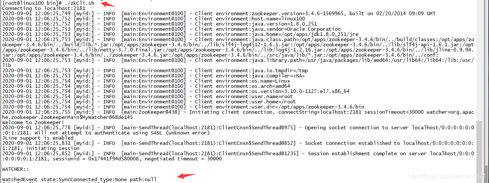

- 查看根目录下节点信息

```shell
ls /1
```


/hbase下所有节点
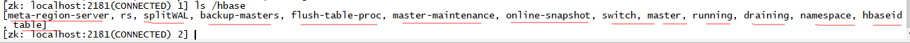
meta表所在节点信息
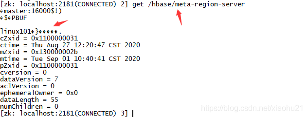
获取splitwal信息
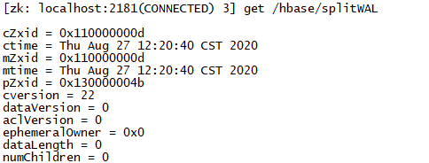
获取table信息
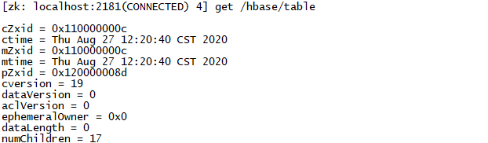

### 3.3 region下线

1. 当region server下线时，和zookeeper的人连接就会断开
   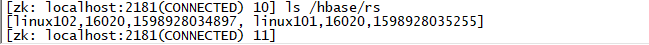
   zookeeper自动释放代表这个server的文件上的独占锁
2. master会定时轮询server目录下文件的锁状态，这里是hbase下wrs目录。如果发现某个region server丢失了自己的独占锁，master就会尝试获取这个读写锁，一旦获取成功，说明

- region server和zookeeper之间断开连接了
- region server挂了

1. master这时候会删除server目录下代表这台region server的文件，并且将这台region server的region 分配给其他还活着的region server。
2. 如果只是网络导致的暂时断开，重新连接zookeeper后，region server就会不断尝试或者这个文件上的锁，一旦获取到，region server就可以继续提供服务
   PS：
   这一点和hdfs中主节点和从节点之间的心跳机制很类似，不是心跳丢失就立即判定从节点有问题，而是会有十次尝试，2次五分钟间隔的主动连接确认。毕竟网络阻塞是很容易产生的

### 3.4 master上线

1. master启动时，从zookeeper上获取唯一一个master的锁，组织其他master节点服务器成为主master。
2. 扫描zookeeper上的server目录，获取当前可用的region server列表
3. 和每个region server通信，获取当前已分配的region和region server的关系。也就是确认每台region server上存储的region信息
4. 扫描meta 表集合，计算当前还没有分配的region，将他们放入待分配region 的列表

### 3.5 master下线

1. 相比hdfs技术架构做了改善的hbase架构，master只维护了表和region的元数据，不参与表数据的id过程，master下线只会导致所有元数据的修改被冻结–无法删除表、修改表schema、无法进行region的负载均衡、无法处理region上下线、region合并
2. 但master下线，集群可以处理region的split操作，因为这个操作只有region server参与
3. master下线后，集群中数据读写可以正常惊醒，所以短时间master下线，对整个集群没有影响。加上本身集群可以启动双master，一个下线，另一个会发挥作用。
   注意，使用hbase安装目录bin目录下的集群启动脚本命令，第二master需要去对应节点上手动启动，如果不配置backup节点信息，这个脚本中不会启动第二master
   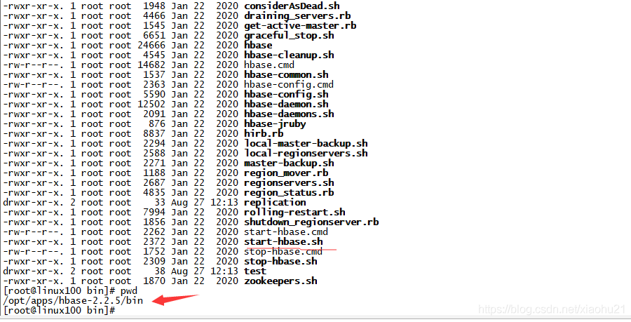
   查看这个集群启动脚本内容

- 这里可以看到，是会启动第二主节点的，但需要配置，也就是要去/conf/hbase-env.sh中配置存放第二主节点文件的目录路径
  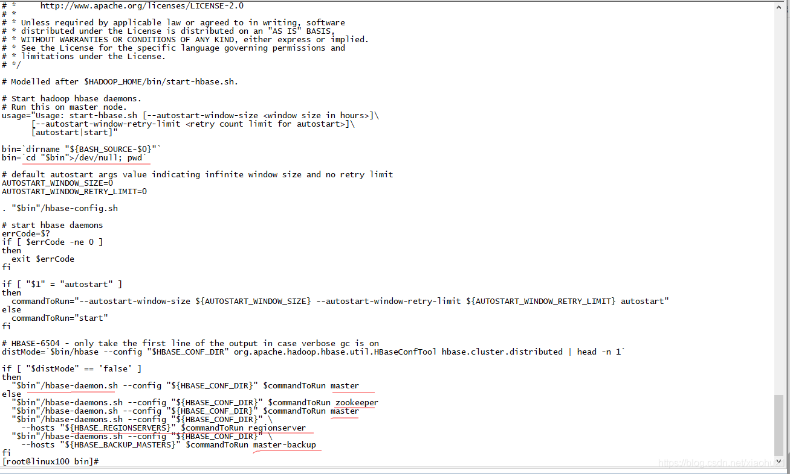
- 这里可以看到，在hbase-env.sh这里配置一下存放第二主节点位置的文件夹路径就可以使用集群脚本一键启动
- 注意要先去对应路径下创建一个目录，目录下存放第二主节点的信息
  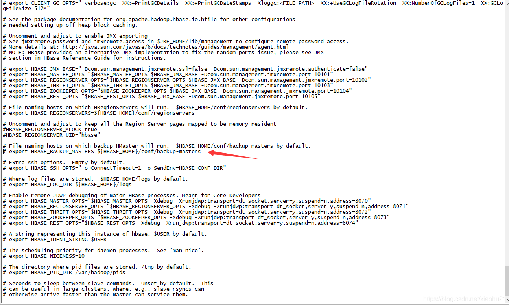

```shell
# 去对应节点服务器上手动启动master服务
hbase-daemon.sh start master
12
```

### 3.6 region拆分

hbase是按照region进行表数据切分，自然而然，region中数据过大或者过小都需要对region做处理。region拆分就是如何对数据进行region级别拆分

1. 当region达到一定大小时，region会被拆分。IncreasingToUpperBoundRegionSplitPolicy
   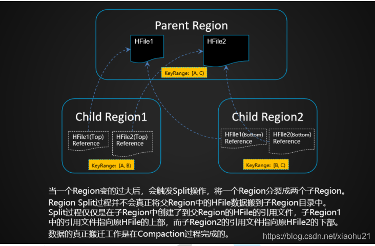

```xml
<property>
<name>hbase.regionserver.region.split.policy</name>
<value>
org.apache.hadoop.hbase.regionserver.IncreasingToUpperBoundRegionSplitPolicy
</value>
</property>
123456
```

当hbase表在regionserver上的region,如果region的大小到达一个阈值，这个region将会分为两个。

> 计算公式为：
> Min{
> 1^3*2*128M 256M
> 2^3*2*128M 2G
> 3^3*2*128M 6.75G
> 10G 10G
> (表在一个regionserver上region的数量的立方) *2（the region memstore flush size),
> hbase.hregion.max.filesize(默认是10GB）
> }
> 达到10GB后，不会继续增加划分粒度，都会按照10GB进行拆分

```xml
<property>
<name>hbase.hregion.max.filesize</name>
<value>10737418240</value>
</property>
<property>
<name>hbase.regionserver.regionSplitLimit</name>
<value>1000</value>
</property>
12345678
```

1. 自定义rowkey进行划分keyPrefixRegionSplitPolicy，这样就是在原本拆分基础上，增加了splitpoint拆分点，好处就是可以更细粒度进行region划分。例如可以把相同rowkey前缀的行划分到同一个region，这样相关联数据就在一个region上。

> 参数是 keyPrefixRegionSplitPolicy.prefix_length rowkey:前缀长度
> 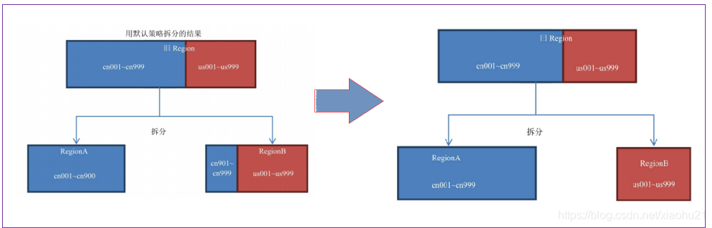

1. DelimitedKeyPrefixRegionSplitPolicy，按照分割符进行拆分。

> DelimitedKeyPrefixRegionSplitPolicy.delimiter

1. region 预拆分，当我们实际生产建立表时，很多时候已经对需要插入的数据有所了解。所以就会对rowkey进行设计，来满足未来的业务查询维度要求。同时为了避免插入热点问题，会对表进行预先分区

> 就是我们建表时，创建的split
> hbase> create ‘tb_computer’, ‘cf1’, SPLITS => [‘d’, ‘g’, ‘j’, ‘o’]

1. 手动强制拆分，一般是遇到预期外的查询热点问题，需要手动将region进行拆分。否则会导致节点过载甚至崩溃

```shell
split 'tableName'
split 'namespace:tableName'
split 'regionName' # format: 'tableName,startKey,id'
split 'tableName', 'splitKey'
split 'regionName', 'splitKey'
12345
```

> 建议
> 1 预拆分初始化的数据
> 2 后续采取自动拆让Hbase来管理region的拆分

### 3.7 region合并

当hbase中执行了大量的删除操作，这时候region中数据量会变小。这时候再将这些数据存放在不同region server的region中就不合适，可以将region进行合并。
不过需要注意，region 级别合并属于大合并，操作时，最好选择业务低峰期。常见java ee属于削峰填谷讲的就是业务高峰期和低峰期应对处理方式。一般2周或者1个月一次，其他根据实际情况来决定频次。

```shell
merge_region 'ce32a3ee89fb3a55b150a6061a2832c3' , '073f9103b56603feec7784ad2c8665fb'
1
```

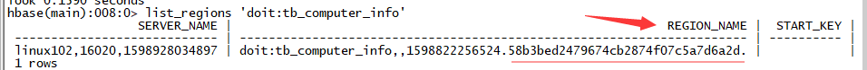

```shell
# shell 命令
hbase> merge_region 'FULL_REGIONNAME', 'FULL_REGIONNAME'
hbase> merge_region 'FULL_REGIONNAME', 'FULL_REGIONNAME', true
hbase> merge_region 'ENCODED_REGIONNAME', 'ENCODED_REGIONNAME'
hbase> merge_region 'ENCODED_REGIONNAME', 'ENCODED_REGIONNAME', true
12345
```

### 3.8 region寻址

前文提过，hbase的架构对比hdfs的架构做了优化，maste让节点不再承载过重功能，相当一部分被拆解到了zookeeper和存储meta 表的region server中。
hbase.meta表存储了所有region的位置和节点对应信息，通过

```shell
# 可以查看
scan hbase:meta 
12
```

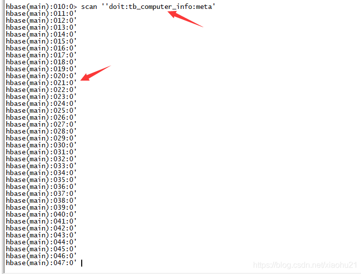
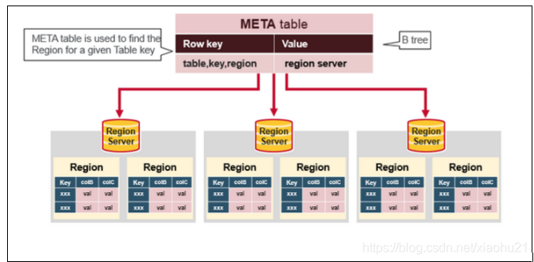
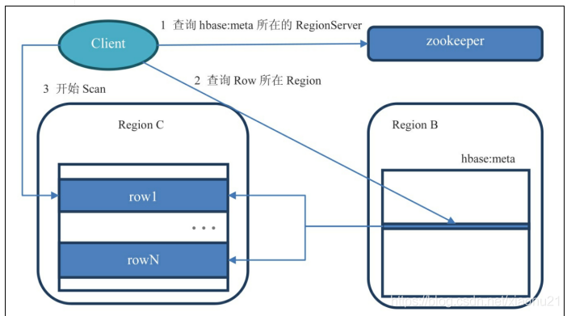

- 客户端会先去zookeeper询问，存储meta表的region server是哪一台，zookeeper会返回这个信息
- 客户端将zookeeper返回的存储meta表region server信息缓存在自己的meta cache中。然后去对应region server请求，对应rowkey数据存储在哪个region server上。（是通过rowkey 在哪个region server的region中，通过范围查找）。因为meta表存储了所有region的行键范围信息。
- 之后，客户端连接对应region server进行数据读写操作