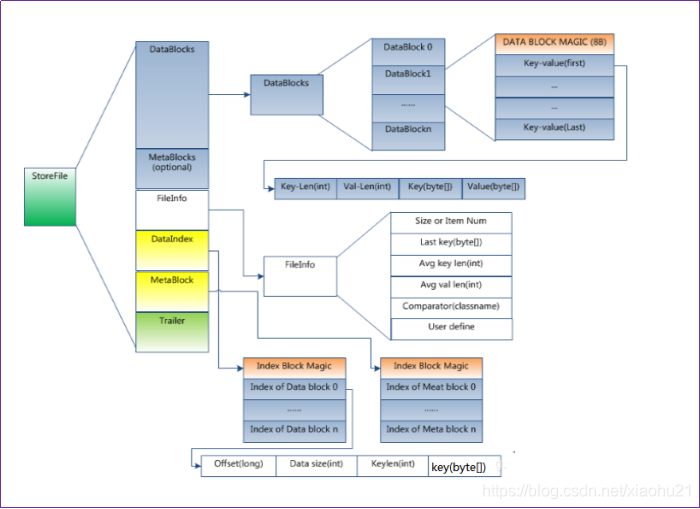
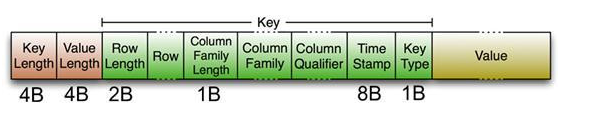
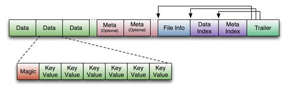
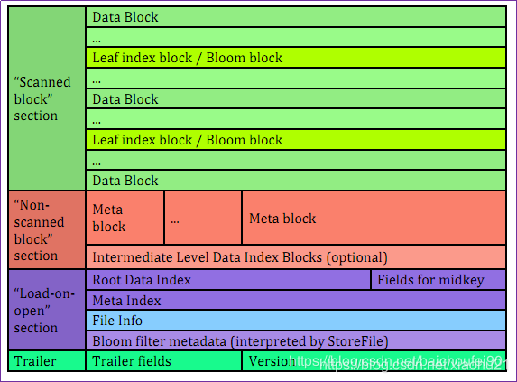
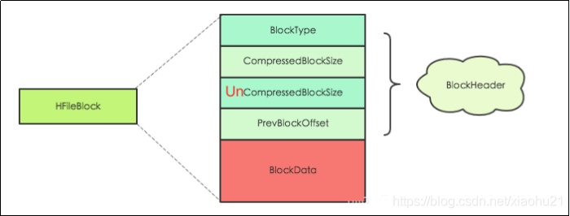
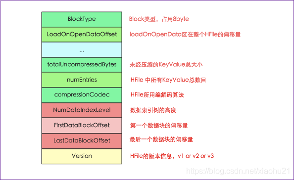
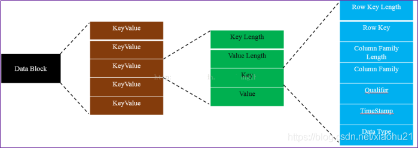
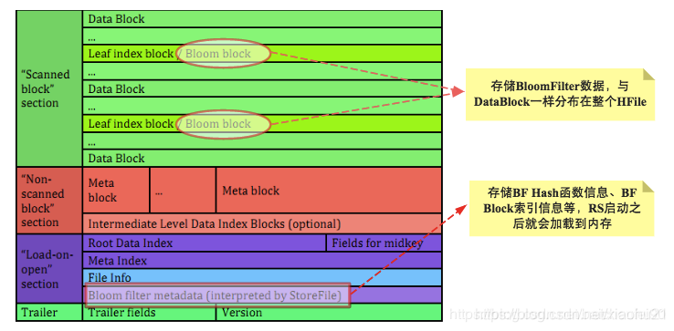
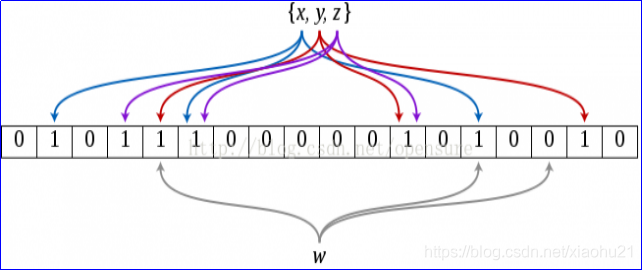
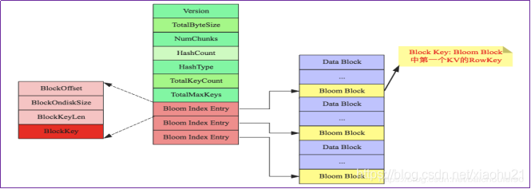

# HBase StoreFile原理总结

## 1. StoreFile是什么

1. 在hbase架构设计中，本身hbase基于hdfs进行数据存储。同时为了提升效率，数据会有一个memstore、block cache来做数据缓存，使用wal日志文件来防止内存数据丢失。但最终都会落地到磁盘中，这个磁盘文件就是store file。具体架构可以看我另一篇博客[HBase架构原理](https://blog.csdn.net/xiaohu21/article/details/108269299)
2. 一个region中会有多个store，按照此前查看hdfs中信息可知，一个列族一个store文件夹，一个列族中会有1到多个HFile（store files）文件
3. store file或者说HFile由更小的block组成。block size是基于每个列族进行配置的，数据压缩也是以块为单位。后续会列文讲解一下hdfs中的数据压缩机制和应用。
4. HFile，顾名思义，就是hdfs中文件存储的一种格式。包含一个多层索引，允许HBase在不读取整个文件的情况下查找数据，这些索引的大小是块大小（默认64KB）
5. 注意，HBase中数据是以key value形式存储，所以如何设计rowkey，以及如何降低rowkey的存储空间都是需要仔细考量的。
6. 可以使用hbase自带命令查看HFile

```shell
hbase hfile -p -f /hbase/data/default/t1/157b4ab800b1d9c89a2e3b22fc511a46/base_info/9ad461c1c4bc47b7a4a772644578c1451
```

## 2.HFile

### 2.1 HFile组成



### 2.2 HFile内部block

- block是 hbase存储的最小单元，HFile只是block之上的一种抽象或者包装。而为了提高IO效率，region server又基于LRU（最近最少淘汰算法）进行block 的cache机制设计。
- 每个block块的大小可以izai创建table的时候通过参数设置，否则默认是64kb。
- 显而易见，大号的block有利于顺序scan，因为关联的数据都会在一个block中。小号的block有利于随机查询
- 组成截图，这里参考官网截图。每个block块中，除了开头的magic魔数之外（一个随机数字，为了防止数据损坏，真的损坏了，也只是随机数字修改了而不是真实存储的数据修改了。实际中数据开头是容易在读写操作中损坏的）




> 1. Data Block 段–保存表中的数据，这部分可以被压缩
> 2. Meta Block 段 (可选的)–保存用户自定义的kv对，可以被压缩。
> 3. File Info 段–Hfile的元信息，不被压缩，用户也可以在这一部分添加自己的元信息。
> 4. Data Block Index 段–Data Block的索引。每条索引的key是被索引的block的第一条记录的key。
> 5. Meta Block Index段 (可选的)–Meta Block的索引。
> 6. Trailer记录了HFile的基本信息，保存了上述每个段的偏移量（即起始位置）[索引].
>    Trailer–这一段是定长的保存了每一段的偏移量，读取一个HFile时，会首先 读取Trailer，Trailer保存了每个段的起始位置(段的Magic Number用来做安全check)，然后，DataBlock Index会被读取到内存中，这样，当检索某个key时，不需要扫描整个HFile，而只需从内存中找到key所在的block，通过一次磁盘io将整个 block读取到内存中，再找到需要的key。

### 2.3 DataBlock Index LRU机制。



> 1. Scanned block section
>    scan（顺序扫描）HFile时所有的Block将被读取
> 2. Non-scanned block section
>    scan时数据不会被读取
> 3. Load-on-open-section
>    RegionServer启动时需要加载到内存
> 4. Trailer
>    记录了HFile的基本信息，保存了上述每个段的偏移量（即起始位置）

### 2.4 Block内部区域

#### 2.4.1 hfile block

1. HFile在传概念是被切分为多个大小相同的block，这个是可以在建立列族时，指定blocksize参数来设置，默认就是64KB。实际比较少进行修改
2. 上述已经说过，大的block有利于顺序scan，小的有利于随机读写。
3. 所有的block具有相同的数据结构
   
4. hfile block支持2种类型，一种支持checksum，一种不支持。checksum就是对文件进行校对的机制
5. block header，就是存储元数据的部分，包括block类型，压缩block大小，上一个block的偏移量等
6. block data，就是存储具体数据
7. block type记录block的类型，hbase一共有8种block。有的存储用户数据，有的存储索引，有的存储meta元数据

#### 2.4.2 trailer block

主要记录HFile的基本信息和各个部分的偏移量，注意文件读取如果要做到随机读取，就需要用到文件的偏移量

Hfile读取数据时，首先会解析trailer block信息，并且加载到[内存](https://so.csdn.net/so/search?q=内存&spm=1001.2101.3001.7020)种，然后再进一步加载load on open section的数据。

> 1 首先加载HFile版本信息： HBase中version包含major version和minor version两部分，前者决定了HFile的主版本v1,v2 or v3，后者决定了在主版本的基础上是否支持一些微小的修正，比如是否支持checkum等。
> 2 根据HFile版本信息，获取trailer的长度，因为版本的trailer长度或许不一样，然后再根据trailer长度加载整个HFile Trailer Block
> 3 加载Load-On-Open section到内存，起始偏移量是trailer中记录的LoadOnOpenDataOffset，结束位置是HFile的length – trailer的length

#### 2.4.3 data block

data block是真正存储数据的最小单元，存储的是用户的key value值


> KeyValue: 是由四部分组成的
> 1 Key Length: 存储key的长度，本身是4个字节
> 2 Value Length: 存储value的长度，本身是4个字节
> 3 Key: 存储数据的key,由Row Key Length+Row Key+Column Family Length +Column Family+Column Qualifier + TimeStamp+Key Type
> 3.1 Row Key Length: 存储row key的长度，总共2字节
> 3.2 Row : 存储row的实际内容，其大小为row key length
> 3.3 Column Family Length：存储列簇 Column Family的长度，占1字节
> 3.4 Column Family：存储Column Family实际内容，大小为Column Family Length；
> 3.5 Column Qualifier：存储Column Qualifier对应的数据，既然key中其他所有字段的大小都知道了，整个key的大小也知道了，那么这个Column Qualifier大小也是明确的了，无需再存储其length
> 3.6 Time Stamp：存储时间戳Time Stamp，占8字节
> 3.7 Key Type：存储Key类型Key Type，占1字节，Type分为Put、Delete、DeleteColumn、DeleteFamilyVersion、DeleteFamily等类型，标记这个KeyValue的类型

综上，这也是为什么说rowkey需要设计的尽可能定长，相对简短的原因，否则仅仅是存储rowkey就需要耗费不少空间了。

#### 2.4.4 HFile索引

当数据进行读取时，如果memstore和block cache中都没有找到对应的数据，那么就需要去store文件中查找 。如何快速找到对应rowkey数据在哪个文件中，这时候就需要索引，来快速判断文件中对应rowkey的data block在哪个位置


> 最多可支持三层索引，
>
> 1. 最底层的Data Block Index称之为Leaf Index Block，可直接索引到Data Block；
> 2. 中间层称之为Intermediate Index Block，
> 3. 最上层称之为Root Data Index，Root Data index存放在一个称之为"Load-on-open Section"区域，Region Open时会被加载到内存中），使用LruBlockCache

- Load-on-open Section
  存放Root Data index，Region打开时就会被加载到内存中
- Scanned Block Section
  DataBlock、存放Data Block索引的Leaf Index Block与Bloom Block(Bloom Filter数据)交叉存在

#### 2.4.5 bloom filter布隆过滤器

- 2.4.4已经提过，如果数据读取时，内存都没命中，就需要进行文件读写。hfile 索引解决了找到rowkey对应的hfile时，如何快速定位到对应data block问题。那还需要解决如何从众多hfile中查找和判定rowkey是否在对应hfile中。布隆过滤器就在这里发挥作用

> 1. HBase中的BloomFilter提供了一个轻量级的内存结构，以便将给定Get（BloomFilter不能与Scans一起使用，而是Scan中的每一行来使用）的磁盘读取次数减少到仅可能包含所需Row的StoreFiles，而且性能增益随着并行读取的数量增加而增加。
>    和BlockIndex区别
> 2. 一个Region有多个Store，一个Store需要扫描多个StoreFile(HFile)，每个HFile有一个BlockIndex，粒度较粗，需要通过key range扫描很多BlockIndex来判断目标key是否可能在该文件中，但仍需要加载该HFile中的若干Block并scan才能确定是否真的存在目标key。（比如一个1GB的HFile，就包含16384个64KB的Block，且BlockIndex只有StartKey信息。查询一个给点key则可能落在两个Block的StartKey范围之间，需要全部load-scan）。
> 3. BloomFilter对于Get操作以及部分Scan操作可以过滤掉很多肯定不包含目标Key的HFile文件，大大减少实际IO次数，提高随机读性能。
>    
> 4. BloomFilter的Hash函数和BloomFilterIndex存储在每个HFile的启动时加载区中；而具体的存放数据的BloomFilterBlock，会随着数据变多而变为多个Block以便按需一次性加载到内存，这些BloomFilterBlock散步在HFile中扫描Block区，不需要更新（因为HFile的不可变性），只是会在删除时会重建BloomFilter，所以不适合大量删除场景。
> 5. 加载时机
>    当因为Region部署到RegionServer而打开HFile时，BloomFilter将加载到内存。

- 简图
  
  

> 如上图，BloomFilterIndex中的BloomIndexEntry中有个BlockKey存有真实数据KeyValue的StartKey，所以每次需要据此来查找BloomFilterBlock进行使用。

- 在hbase中使用布隆过滤器

> 创建HBase表时可用HColumnDescriptor.setBloomFilterType(NONE/ROW (default)/ ROWCOL)或用以下命令创建BloomFilter:
> create ‘tb_haha’, {NAME => ‘cf1’, BLOOMFILTER => ‘ROWCOL’}

bloom filter的数据存在StoreFile的meta中，一旦写入无法更新，因为StoreFile是不可变的。==Bloomfilter是一个列族（cf）级别的配置属性，如果你在表中设置了Bloomfilter，那么HBase会在生成StoreFile时包含一份bloomfilter结构的数据，称其为MetaBlock；MetaBlock与DataBlock（真实的KeyValue数据）一起由LRUBlockCache维护。==所以，开启bloomfilter会有一定的存储及内存cache开销。

- 布隆过滤器类型

> ROW
> 根据KeyValue中的row来过滤storefile
> 举例：假设有2个storefile文件sf1和sf2，
> sf1包含kv1（r1 cf:q1 v）、kv2（r2 cf:q1 v）
> sf2包含kv3（r3 cf:q1 v）、kv4（r4 cf:q1 v）
> 如果设置了CF属性中的bloomfilter为ROW，那么get(r1)时就会过滤sf2，get(r3)就会过滤sf1

> ROWCOL
> 根据KeyValue中的row+qualifier来过滤storefile
> 举例：假设有2个storefile文件sf1和sf2，
> sf1包含kv1（r1 cf:q1 v）、kv2（r2 cf:q1 v）
> sf2包含kv3（r1 cf:q2 v）、kv4（r2 cf:q2 v）
> 如果设置了CF属性中的bloomfilter为ROW，无论get(r1,q1)还是get(r1,q2)，都会读取sf1+sf2；而如果设置了CF属性中的bloomfilter为ROWCOL，那么get(r1,q1)就会过滤sf2，get(r1,q2)就会过滤sf1

> 1.任何类型的get（基于rowkey或row+col）Bloom Filter的优化都能生效，关键是get的类型要匹配Bloom Filter的类型
> 2.基于row的scan是没办法走Bloom Filter的。因为Bloom Filter是需要事先知道过滤项的。对于顺序scan是没有事先办法知道rowkey的。而get是指明了rowkey所以可以用Bloom Filter，scan指明column同理。
> 3.row+col+qualify的scan可以去掉不存在此qualify的storefile，也算是不错的优化了，而且指明qualify也能减少流量，因此scan尽量指明qualify。

#### 2.4.6 key value

hbase存储的数据本质就是key value。所以如何从key value级别对数据进行读写，存储优化也是需要仔细考虑的。


> 一个KeyValue类里面最后一个部分是存储数据的Value，而前面的部分都是存储跟该单元格相关的元数据信息。如果你存储的value很 小，那么这个单元格的绝大部分空间就都是rowkey、column family、 column等的元数据，所以大家的列族和列的名字如果很长，大部分的空 间就都被拿来存储这些数据了。
> 不过如果采用适当的压缩算法就可以极大地节省存储列族、列等信息的空间了，所以在实际的使用中，可以通过指定压缩算法来压缩这些元数据。
> 不过压缩和解压必然带来性能损耗，所以使用压缩也需要根据实际情况来取舍。如果你的数据主要是归档数据，不太要求读写性能，那么压缩算法就比较适合你。

## 3.Flush

#### 3.1 flush概述

1. 按照此前架构图来说，为了提升数据IO性能，在内存中有memstore，有block cache。block cache针对读取数据时缓存，memcache则主要是写入数据缓存。
2. 因为内存中数据不可能是无限制存放，需要定时写入到磁盘文件中，同时为了防止内存数据丢失，发明了wal日志文件机制，这一点和hdfs的checkpoint机制很像。都是通过日志文件来记录操作和关键数据信息，然后通过日志来进行数据还原。类比一下mysql的binlog进行数据同步，一样的道理
3. 内存中数据会进行排序，按照rowkey升序排列，这一点和mapreduce的shuffle阶段类似，也是为了保证内存中数据写入到磁盘时数据就是有序的。
4. 同时，内存缓存因为也是按照key value形式存储数据，所以如果读取数据时，内存缓存中刚好有，就可以省去磁盘文件中读取数据的时间消耗。内存中排好序，这样写入hdfs文件的时候就不需要再次排序，排好序的数据写入到hdfs文件中，查找时也更快。
5. 如果同一批次涉及对同一个cell的更新操作，则可以进行细粒度的优化，如只取最后一次更新的cell数据写入到磁盘中，可以降低磁盘IO

#### 3.2 flush过程

##### 3.2.1 prepare准备阶段

1. 遍历当前Region中的所有Memstore，将Memstore中当前数据集kvset做一个快照snapshot，对后来的读请求提供服务，读不到再去BlockCache/HFile中查找。
2. 然后再新建一个新的kvset Memstore(SkipList)，服务于后来的写入。
3. prepare阶段需要加一把写锁对写请求阻塞，结束之后会释放该锁。因为此阶段没有任何费时操作，因此持锁时间很短。

##### 3.2.2 flush刷写阶段

1. 遍历所有Memstore，将prepare阶段生成的snapshot持久化为临时文件，临时文件会统一放到目录.tmp下。这个过程因为涉及到磁盘IO操作，因此相对比较耗时，但不会影响读写。
2. 当Flush发生时，当前MemStore实例会被移动到一个snapshot中，然后被清理掉。在此期间，新来的写操作会被新的MemStore和刚才提到的备份snapshot接收，直到flush成功后，snapshot才会被废弃。

##### 3.2.3 commit提交阶段

1. 遍历Region所有的Memstore，将flush阶段生成的临时文件移到指定的ColumnFamily目录下，针对HFile生成对应的storefile和Reader，随后把storefile添加到HStore的storefiles列表中。
2. 最后清空prepare阶段生成的snapshot。
3. 整个flush过程还可能涉及到compact和split

#### 3.3 flush时机

因为flush是将内存中数据写入到磁盘，所以刷写时机和内存相关的触发条件、wal日志条件、人为强制等条件相关

1. Region级别-跨列族
   Region内的其中一个MemStore大小达到阈值(hbase.hregion.memstore.flush.size)，该Region所有MemStore一起发生Flush，输入磁盘。默认大小是128M !
2. RegionServer级别
   当一个RS内的全部MemStore使用内存总量所占比例达到了阈值(hbase.regionserver.global.memstore.upperLimit)，那么会一起按Region的MemStore用量降序排列flush，直到降低到阈值(hbase.regionserver.global.memstore.lowerLimit)
3. 新的参数hbase.regionserver.global.memstore.size，设定了一个RS内全部Memstore的总大小阈值，默认大小为Heap的40%，达到阈值以后就会阻塞更新请求，并开始RS级别的MemStore flush，和上述行为相同。
4. HLog-WAL文件
   当region server的WAL的log数量达到hbase.regionserver.max.logs，该server上多个region的MemStore会被刷写到磁盘（按照时间顺序），以降低WAL的大小。否则会导致故障恢复时间过长。默认是100万条操作记录
5. 手动触发
   通过HBase shell或Java Api手动触发MemStore flush

## 4.总结

store file关键知识点，记住几条即可

1. 数据存储在hbase中采用了缓存机制，memstore内存缓存，为了防止内存丢失采取了wal日志机制。
2. 内存中数据最终是要flush到磁盘文件中的
3. 数据本身是存储在hdfs的文件中，以key value形式存储。最小的存储单元是data block。key就是rowkey，为了降低rowkey空间占用，设计时需要相对简短，同时可以采取一定压缩策略
4. 当数据读取时，在memstore和block cache中查找不到，就需要去store file中查找。一个region中有多个store（一个列族一个store），一个store体现在hdfs中就是一个文件夹，文件夹中有多个hfile文件。
5. 为了优化文件查找和读取效率，文件快速判断引入了bloom过滤器机制，但会牺牲一定性能和磁盘空间。为了优化data block定位速度，引入了索引机制